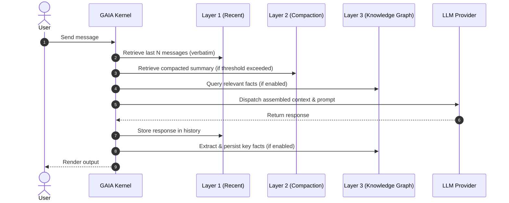

# Context Layers — How GAIA Manages Conversation History

GAIA uses three complementary layers to manage conversation context. Each layer serves a different purpose, and together they balance **cost** (token usage) against **fidelity** (not losing important details).

---

## The Three Layers

```mermaid
graph TD
    subgraph Layer1 [Layer 1: Recent Messages (Verbatim)]
        L1A[Last N messages complete and untouched]
        L1B[Default: 10 messages — ~3-5k tokens]
        L1C[Zero loss — everything preserved]
    end
    subgraph Layer2 [Layer 2: Compacted History (Summary)]
        L2A[Messages beyond window → LLM summary]
        L2B[Activates at compaction threshold — default 50]
        L2C[Preserves key decisions and rehydrated context]
    end
    subgraph Layer3 [Layer 3: Knowledge Graph (Opt-In)]
        L3A[Key facts extracted → stored in SQLite]
        L3B[Injected before turn based on keywords]
        L3C[Default: OFF — enabled via /kg on]
    end
```

## How It Works at Each Turn



## Layer 3: Knowledge Graph Recall

### When to Enable

| Scenario | Recommended |
|----------|-------------|
| Short sessions (<50 messages) | OFF — Layer 1 + 2 is enough |
| Long sessions (>100 messages) | ON — saves tokens on repeated context |
| Detailed debugging | OFF — don't risk losing subtle details |
| Research/exploration | ON — facts help recall past findings |
| Cost-sensitive (API costs) | ON — significantly reduces token usage |

### What Gets Extracted

The system looks for lines containing technical indicators:

- `uses` — "The system uses JWT for authentication"
- `implements` — "implements the Repository pattern"
- `migrate` / `changed` / `refactored` — "migrated from MySQL to PostgreSQL"
- `decision:` — "decision: use refresh tokens"
- `recommend` — "recommend 7-day expiry"
- `configured` — "configured with 25 connection pool"

### What Does NOT Get Extracted

- Code blocks (``` ... ```)
- Headers (# Title)
- Lines under 30 characters
- Generic chat ("OK", "sure", "let me check")

### Commands

```
/kg          → Show status and fact count
/kg on       → Enable KG recall for this session
/kg off      → Disable KG recall
/kg stats    → Show facts grouped by topic
/kg clear    → Clear all stored facts
```

### Configuration

```yaml
# ~/.config/gaia/config.yaml
budget:
  keep_recent_messages: 10    # Layer 1: messages kept verbatim
  compaction_threshold: 50    # Layer 2: when to compact
  keep_recent_messages: 20    # Messages kept after compaction
```

## Comparison

| Aspect | Layer 1 (Recent) | Layer 2 (Compaction) | Layer 3 (KG) |
|--------|-----------------|---------------------|--------------|
| Fidelity | 100% | ~80% (summary) | ~30% (facts only) |
| Token cost | High (grows) | Low (fixed) | Very low (~500 tokens) |
| Always on | Yes | Yes | No (opt-in) |
| Controls | `keep_recent_messages` | `compaction_threshold` | `/kg on/off` |
| Best for | Recent context | Historical context | Cross-session recall |

## Trade-off Summary

**More layers = more context but higher cost.**
**Fewer layers = cheaper but potentially less relevant context.**

The default configuration (Layer 1 + 2) is the best balance for most sessions.
Enable Layer 3 when you're on long sessions and want to save tokens.
