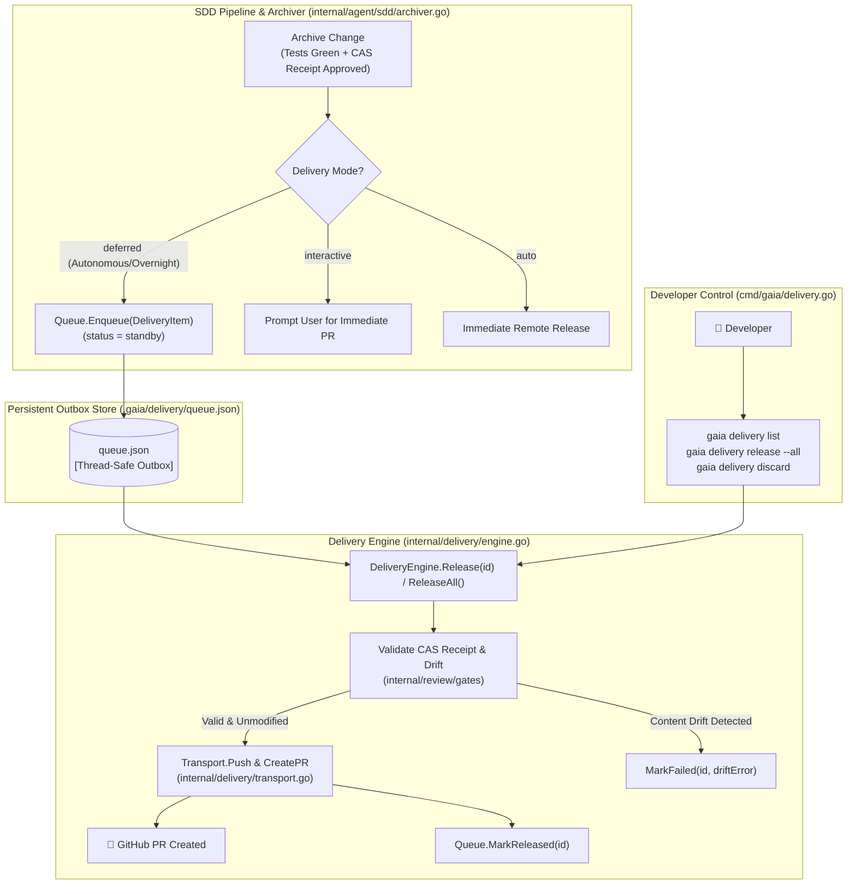

# Deferred Delivery Queue System

The GAIA Delivery subsystem implements a **Local-First Outbox Pattern** to decouple autonomous local execution, testing, and adversarial review from remote network transport and GitHub PR creation.

---

## 1. Architectural Overview



---

## 2. Delivery Modes

GAIA supports three distinct delivery execution policies:

| Mode | Behavior | Ideal Use Case |
|---|---|---|
| `deferred` (Default for Autonomous Work) | Changes are archived locally, PR title and markdown description are auto-generated, and a `DeliveryItem` is stored in `.gaia/delivery/queue.json` in `standby` status without touching remote git. | Overnight runs, offline work, chained feature developments, and batch PR reviews. |
| `interactive` | Prompt the user immediately upon change archival to confirm whether to push and open a GitHub PR. | Active pairing sessions with direct human supervision. |
| `auto` | Automatically push branch and create remote PR immediately upon successful change archival. | Unattended CI/CD runners or high-trust automation. |

---

## 3. Guarantees & Safety Mechanisms

### 3.1 Content-Addressable Storage (CAS) Receipt Verification
Before pushing any branch or creating a pull request, the `DeliveryEngine` loads the review receipt from `gates.ReceiptStore` (Git CAS refs `refs/gaia-reviews/<change>` or `.gaia/reviews/`) and verifies:
- Receipt exists and is in `approved` state.
- The `ReceiptLineage` matches the lineage frozen during review.
- If the local tree or files were modified after review approval, the release fails with `ErrContentDrift`, transitions the item to `failed`, and halts remote execution without pushing unverified code.

### 3.2 Topological Stacked Branch Ordering
When delivering chained pull requests (`ReleaseAll()`), child branches depend on parent base branches. The Delivery Engine computes an in-degree dependency graph and releases branches in topological order (e.g. `main` -> `feature/pr1` -> `feature/pr2`).

---

## 4. CLI Commands

### 4.1 List Queued Deliveries
Display all queued delivery items or filter by status (`standby`, `released`, `discarded`, `failed`):

```bash
# List all items
gaia delivery list

# Filter by status
gaia delivery list --status standby
```

Example Output:
```
ID     CHANGE       BRANCH                BASE   STATUS    PR URL                                  CREATED AT
--     ------       ------                ----   ------    ------                                  ----------
del-1  auth-models  feature/auth-models   main   released  https://github.com/org/repo/pull/101   2026-09-05 22:30:00
del-2  auth-jwt     feature/auth-jwt      del-1  standby   -                                       2026-09-05 23:15:00
```

### 4.2 Queue Metrics & Status Summary
Inspect summary counts across all delivery statuses:

```bash
gaia delivery status
```

Example Output:
```
Delivery Queue Status Summary:
  Total:     4
  Standby:   2
  Released:  1
  Failed:    0
  Discarded: 1
```

### 4.3 Releasing Queued Items

Release a specific delivery item by its unique ID:
```bash
gaia delivery release del-2
```

Release all standby items in dependency order:
```bash
gaia delivery release --all
```

### 4.4 Discarding an Item
Mark an item as discarded if it is no longer intended for remote delivery:

```bash
gaia delivery discard del-2
```

### 4.5 Inspecting Metadata and Diff
Inspect the PR title, generated PR description, target branches, and git diff stat for a queued delivery item:

```bash
gaia delivery diff del-2
```
