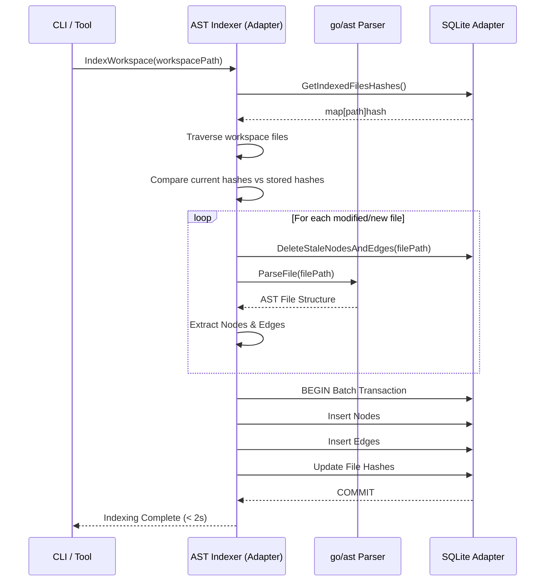
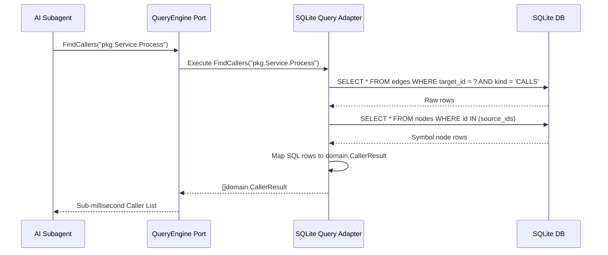

# Technical Design: CodeGraph AST Indexer

## Architecture Overview

The CodeGraph AST Indexer is a high-performance, Go-native architectural indexer designed to power AI subagents. Built using Hexagonal Architecture, the system is divided into core domain entities, ports (interfaces), and adapters. 

The primary components are:
1. **Domain:** Defines the structural entities (`Node`, `Edge`, `Symbol`, `CallHierarchyTree`) and relationship types.
2. **Ports:** Defines contracts for the `Indexer` (workspace discovery and AST parsing) and `QueryEngine` (semantic graph queries).
3. **Adapters:**
   - **AST Adapter:** Utilizes `go/ast`, `go/parser`, and `go/token` to traverse files, extract nodes, and identify relationships.
   - **SQLite Adapter:** Implements persistence and retrieval using `modernc.org/sqlite`.

By performing heavy AST parsing and relationship resolution upfront and storing explicit edges in SQLite, the engine guarantees sub-millisecond semantic queries (e.g., call hierarchies, interface implementations) for downstream AI tooling.

## Architecture Decisions

*   **AD-1: Pure Go SQLite Driver (`modernc.org/sqlite`)**
    *   *Context:* We need a robust local relational database to store the index.
    *   *Decision:* Use `modernc.org/sqlite` instead of `mattn/go-sqlite3`.
    *   *Rationale:* Eliminates the need for CGO, ensuring seamless cross-platform binary compilation while maintaining sufficient performance for local sub-millisecond queries.
*   **AD-2: Explicit Edge Pre-computation**
    *   *Context:* Querying relationships like "what implements interface X" or "callers of function Y" can be computationally heavy if resolved at query time.
    *   *Decision:* Resolve all structural (`CONTAINS`, `RECEIVER_OF`) and behavioral (`CALLS`, `IMPLEMENTS`) relationships during the AST parsing phase and store them as explicit rows in the `edges` table.
    *   *Rationale:* Shifts the cost to the indexing phase (which is batch-optimized to finish in <2s) to guarantee the <1ms query latency SLO.
*   **AD-3: Incremental Indexing via File Hashes**
    *   *Context:* Re-indexing a 100k LOC codebase on every agent run is wasteful. Real-time file watching is out of scope.
    *   *Decision:* Store file content hashes or modification timestamps in a `files` table. On subsequent runs, skip unchanged files and purge stale nodes/edges for modified or deleted files.
    *   *Rationale:* Achieves sub-second incremental updates while keeping the architecture simple (no daemon/watcher required).
*   **AD-4: Hexagonal Architecture Separation**
    *   *Context:* The AI subagent tools need to query the index without tight coupling to SQLite or `go/ast`.
    *   *Decision:* Implement strict separation: `internal/codegraph/domain/` has zero external dependencies, `internal/codegraph/ports/` defines the interfaces, and `internal/codegraph/adapters/` contains the implementation details.

## SQLite Schema

The database relies on three highly normalized tables optimized with indices.

```sql
-- Tracks indexed files for incremental updates
CREATE TABLE files (
    path TEXT PRIMARY KEY,
    hash TEXT NOT NULL,
    updated_at DATETIME DEFAULT CURRENT_TIMESTAMP
);

-- Stores structural symbols (packages, funcs, structs, etc.)
CREATE TABLE nodes (
    id TEXT PRIMARY KEY,       -- Unique identifier (e.g., "github.com/org/repo/pkg.Func")
    kind TEXT NOT NULL,        -- 'package', 'struct', 'interface', 'func', 'method', 'field'
    name TEXT NOT NULL,
    package TEXT NOT NULL,
    file TEXT NOT NULL,
    line_start INTEGER NOT NULL,
    line_end INTEGER NOT NULL,
    signature TEXT,            -- e.g., "(p []byte) (n int, err error)"
    doc TEXT,                  -- associated docstrings
    is_exported BOOLEAN NOT NULL
);

-- Optimizes symbol lookups by kind, name, and package
CREATE INDEX idx_nodes_kind_name ON nodes(kind, name);
CREATE INDEX idx_nodes_package ON nodes(package);

-- Stores directed relationships between nodes
CREATE TABLE edges (
    id TEXT PRIMARY KEY,
    source_id TEXT NOT NULL,   -- FK to nodes.id
    target_id TEXT NOT NULL,   -- FK to nodes.id
    kind TEXT NOT NULL,        -- 'CONTAINS', 'RECEIVER_OF', 'CALLS', 'IMPLEMENTS', 'IMPORTS'
    file TEXT,                 -- call site file (if applicable)
    line INTEGER,              -- call site line (if applicable)
    FOREIGN KEY(source_id) REFERENCES nodes(id) ON DELETE CASCADE,
    FOREIGN KEY(target_id) REFERENCES nodes(id) ON DELETE CASCADE
);

-- Optimizes bi-directional relationship traversals
CREATE INDEX idx_edges_source_target ON edges(source_id, target_id);
CREATE INDEX idx_edges_target_kind ON edges(target_id, kind);
CREATE INDEX idx_edges_source_kind ON edges(source_id, kind);
```

## Go Component Interfaces

### Domain Entities (`internal/codegraph/domain`)
```go
package domain

type SymbolRef string

type SymbolNode struct {
    ID         SymbolRef
    Kind       string
    Name       string
    Package    string
    File       string
    LineStart  int
    LineEnd    int
    Signature  string
    Doc        string
    IsExported bool
}

type Edge struct {
    ID       string
    SourceID SymbolRef
    TargetID SymbolRef
    Kind     string
    File     string
    Line     int
}

// ... Additional types for CallHierarchyTree, CallerResult, CalleeResult, StructDetails
```

### Ports (`internal/codegraph/ports`)
```go
package ports

import "context"
import "internal/codegraph/domain"

type IndexerPort interface {
    // IndexWorkspace recursively discovers, parses, and persists Go files in the given directory.
    IndexWorkspace(ctx context.Context, workspacePath string) error
}

type QueryEnginePort interface {
    FindCallers(ctx context.Context, target domain.SymbolRef) ([]domain.CallerResult, error)
    FindCallees(ctx context.Context, source domain.SymbolRef) ([]domain.CalleeResult, error)
    FindImplementations(ctx context.Context, interfaceRef domain.SymbolRef) ([]domain.SymbolNode, error)
    GetCallHierarchy(ctx context.Context, root domain.SymbolRef, direction domain.HierarchyDirection, maxDepth int) (*domain.CallHierarchyTree, error)
    LookupSymbol(ctx context.Context, criteria domain.SymbolFilter) ([]domain.SymbolNode, error)
    GetStructDetails(ctx context.Context, structRef domain.SymbolRef) (*domain.StructDetails, error)
}
```

## Sequence Diagrams

### 1. Incremental Indexing Workflow



### 2. Subagent Querying (Callers Lookup)


