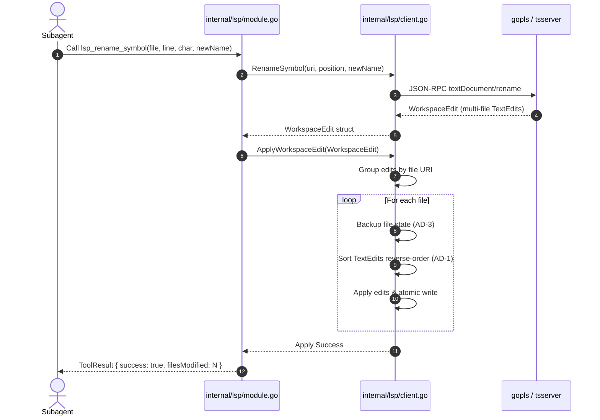

# LSP Active Refactor Design

## Architecture Overview
The Gentle AI LSP architecture is evolving from a passive syntax/diagnostic reader into an active refactoring engine. This change extends the existing JSON-RPC client to support `textDocument/rename`, `textDocument/references`, and `textDocument/codeAction`. It introduces a WorkspaceEdit applier responsible for safely modifying files on disk across the workspace, and maps these capabilities to AI agent tools inside `internal/lsp/module.go`.

## Architecture Decisions

### AD-1: Reverse-order Text Edit Application Algorithm
When applying a `WorkspaceEdit`, multiple `TextEdit` operations may target the same file. Applying edits top-to-bottom shifts character and line offsets for subsequent edits.
**Decision:** All `TextEdit` entries for a given file will be sorted in reverse order (descending by end line, then end character) before application to preserve offset integrity.

### AD-2: JSON-RPC Schema Decoding for LSP 3.17
LSP 3.17 defines complex unions for CodeAction, Command, and WorkspaceEdit types.
**Decision:** We will strictly decode against the LSP 3.17 specification data models. Minor structural differences between `gopls`, `pylsp`, and `tsserver` will be handled via strict struct unmarshaling in the JSON-RPC layer without introducing server-specific forks in the core logic.

### AD-3: Atomic Backup Before WorkspaceEdit Application
Multi-file modifications risk corrupting a workspace if the process is interrupted or a write fails halfway.
**Decision:** Before applying a `WorkspaceEdit`, the system will create an atomic backup of the target files' current state in memory or a temporary directory. If any file fails to write, the process will fail fast and roll back all touched files to their pre-edit state.

### AD-4: Subagent Tool Wiring in `internal/lsp/module.go`
Agents need standard tool schemas to execute refactors regardless of the underlying language.
**Decision:** The capabilities will be exposed as standard tools (`lsp_rename_symbol`, `lsp_find_references`, `lsp_code_actions`) in `internal/lsp/module.go`, mapping abstract tool arguments (file, line, char) to the underlying LSP client methods.

## Component Models & Interfaces

### Data Models
Data models conform to the LSP 3.17 standard and are defined in the JSON-RPC layer:
*   **Position:** `{ line: int, character: int }`
*   **Range:** `{ start: Position, end: Position }`
*   **Location:** `{ uri: DocumentUri, range: Range }`
*   **TextEdit:** `{ range: Range, newText: string }`
*   **WorkspaceEdit:** `{ changes: map[DocumentUri][]TextEdit }`
*   **CodeActionContext:** `{ diagnostics: []Diagnostic, only?: []CodeActionKind }`
*   **CodeAction:** `{ title: string, kind?: CodeActionKind, edit?: WorkspaceEdit, command?: Command }`

### Client Interfaces (`internal/lsp/client.go`)
```go
package lsp

import "context"

type RefactoringClient interface {
    RenameSymbol(ctx context.Context, uri string, pos Position, newName string) (*WorkspaceEdit, error)
    FindReferences(ctx context.Context, uri string, pos Position, includeDecl bool) ([]Location, error)
    CodeActions(ctx context.Context, uri string, rng Range, context CodeActionContext) ([]CodeAction, error)
    ApplyWorkspaceEdit(ctx context.Context, edit *WorkspaceEdit) error
}
```

### Tool Definitions (`internal/lsp/module.go`)
The `LSPModule` exposes the following tool handlers for subagents:
*   `ExecuteRename(args RenameArgs) ToolResult`
*   `ExecuteFindReferences(args ReferenceArgs) ToolResult`
*   `ExecuteCodeActions(args CodeActionArgs) ToolResult`

## Sequence Diagrams

### Rename Symbol Across Multiple Files


