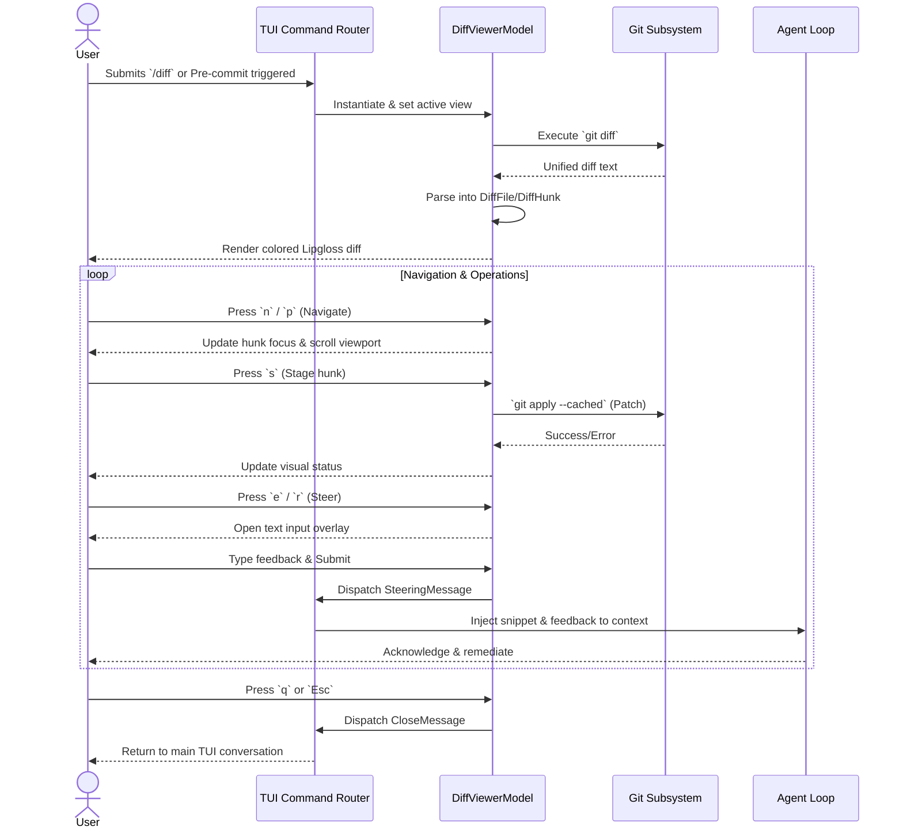

# Technical Design: TUI Interactive Diff Viewer

## Architecture Overview

The TUI interactive diff viewer introduces a native, interactive visual interface within the GAIA Bubbletea application. It allows users to review, stage, discard, and steer agent-generated code modifications before they are committed. The component operates as a standalone Bubbletea modal (`DiffViewerModel`) that is instantiated via the `/diff` command or intercepted during the pre-commit workflow. 

It wraps Git plumbing commands (`git diff`, `git apply`) to manage state, parses unified diff output into structured Go models, and uses Lipgloss for terminal-aware colored rendering. Steering feedback is passed back to the agent loop via channel injection.

## Architecture Decisions

*   **AD-1: Unified Diff Parser**
    Rather than relying on third-party diff rendering libraries, we will implement a custom unified diff parser. It will process raw `git diff` output streams into structured domain models (`DiffFile`, `DiffHunk`, `DiffLine`). This ensures full control over hunk header offsets, line numbers, and selective patch construction for staging.
*   **AD-2: Bubbletea Modal Model**
    The viewer will implement the `tea.Model` interface as an overlay/modal component (`DiffViewerModel`). The TUI command router will delegate `Update` and `View` calls to this model when active, preserving the background conversation state and allowing seamless return upon exit.
*   **AD-3: Hunk-by-Hunk Staging via Git Apply**
    Staging (`s`), unstaging (`u`), and discarding (`d`) will be implemented by reconstructing valid unified diff patches for the currently focused hunk and piping them to `git apply --cached` (for staging) or `git apply --reverse` (for discarding).
*   **AD-4: Steering Channel Injection**
    User steering feedback triggered via `e`/`r` will open an embedded text input. Upon submission, a payload containing the file path, hunk diff snippet, line range, and user comment will be dispatched via a Bubbletea `tea.Cmd`. The main agent loop will intercept this message, close the diff view, and inject the feedback into the LLM context for remediation.

## Bubbletea Component Models & Interfaces

### Data Models

```go
// DiffLine represents a single addition, deletion, or context line.
type DiffLine struct {
    Type    LineType // Addition, Deletion, Context
    Content string
    OldLine int
    NewLine int
}

// DiffHunk represents a modified block with metadata for patch generation.
type DiffHunk struct {
    Header     string
    Lines      []DiffLine
    OldStart   int
    OldLines   int
    NewStart   int
    NewLines   int
    IsStaged   bool
}

// DiffFile contains path metadata and its associated hunks.
type DiffFile struct {
    OldPath    string
    NewPath    string
    IsBinary   bool
    Hunks      []DiffHunk
}
```

### Bubbletea Interfaces

```go
// DiffViewerModel handles the diff view lifecycle and interactions.
type DiffViewerModel struct {
    Files          []DiffFile
    FocusedFile    int
    FocusedHunk    int
    Viewport       viewport.Model
    SteeringInput  textinput.Model
    Mode           ViewerMode // Navigating, Steering, Error
    TerminalWidth  int
    TerminalHeight int
}

// Init initializes the viewport and async diff loading.
func (m DiffViewerModel) Init() tea.Cmd

// Update processes keybindings and git operations.
func (m DiffViewerModel) Update(msg tea.Msg) (tea.Model, tea.Cmd)

// View renders the Lipgloss-styled diff output.
func (m DiffViewerModel) View() string
```

### Keybindings

*   **Navigation:** `n` (next hunk), `p` (prev hunk), `j` / `k` / `Up` / `Down` (scroll viewport).
*   **Operations:** `s` (stage hunk), `u` (unstage hunk), `d` (discard hunk).
*   **Steering:** `e` or `r` (open steering input overlay for the active hunk).
*   **Exit:** `q` or `Esc` (close viewer, return to conversation).

## Sequence Diagram


