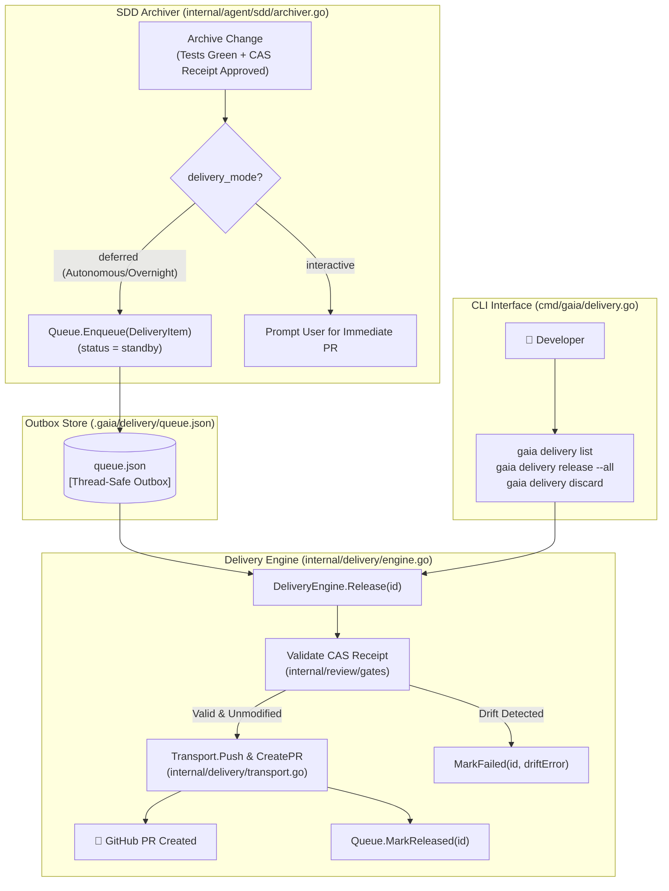

# Technical Design: Deferred Delivery Queue System

## 1. Architectural Overview

The Deferred Delivery Queue implements a **Local-First Outbox Pattern** to decouple autonomous local execution from remote GitHub network transport.



---

## 2. Interface Contracts & Data Models

### 2.1 Domain Types (`internal/delivery/manifest.go`)

```go
package delivery

import "time"

type DeliveryStatus string

const (
	StatusStandby   DeliveryStatus = "standby"
	StatusReleased  DeliveryStatus = "released"
	StatusDiscarded DeliveryStatus = "discarded"
	StatusFailed    DeliveryStatus = "failed"
)

type DeliveryItem struct {
	ID             string         `json:"id"`              // del-1, del-2, or slug
	ChangeName     string         `json:"change_name"`     // SDD change name
	Branch         string         `json:"branch"`          // Local git branch
	BaseBranch     string         `json:"base_branch"`     // Upstream base branch (e.g., main or parent PR branch)
	CommitSHA      string         `json:"commit_sha"`      // HEAD commit hash
	ReceiptLineage string         `json:"receipt_lineage"` // CAS receipt lineage hash
	PRTitle        string         `json:"pr_title"`        // GitHub PR title
	PRBody         string         `json:"pr_body"`         // Markdown PR description
	Status         DeliveryStatus `json:"status"`          // standby, released, discarded, failed
	ErrorMessage   string         `json:"error_message,omitempty"`
	PRURL          string         `json:"pr_url,omitempty"`
	CreatedAt      time.Time      `json:"created_at"`
	ReleasedAt     *time.Time     `json:"released_at,omitempty"`
}
```

### 2.2 Queue Interface & Store (`internal/delivery/queue.go`)

```go
type Queue interface {
	Enqueue(item DeliveryItem) error
	List(filter ...DeliveryStatus) ([]DeliveryItem, error)
	Get(id string) (*DeliveryItem, error)
	MarkReleased(id string, prURL string) error
	MarkDiscarded(id string) error
	MarkFailed(id string, reason string) error
	Clear() error
}

type FileQueue struct {
	mu       sync.RWMutex
	filePath string
}
```

### 2.3 Transport Interface (`internal/delivery/transport.go`)

```go
type Transport interface {
	PushBranch(ctx context.Context, branch string) error
	CreatePullRequest(ctx context.Context, item DeliveryItem) (string, error)
}
```

### 2.4 Delivery Engine (`internal/delivery/engine.go`)

```go
type Engine struct {
	queue     Queue
	transport Transport
	casStore  gates.ReceiptStore
	repoRoot  string
}

type ReleaseResult struct {
	ItemID  string `json:"item_id"`
	Branch  string `json:"branch"`
	PRURL   string `json:"pr_url,omitempty"`
	Success bool   `json:"success"`
	Error   string `json:"error,omitempty"`
}

func (e *Engine) Release(ctx context.Context, itemID string) (*ReleaseResult, error)
func (e *Engine) ReleaseAll(ctx context.Context) ([]ReleaseResult, error)
```

---

## 3. Storage Schema (`.gaia/delivery/queue.json`)

```json
[
  {
    "id": "del-1",
    "change_name": "feat-auth-models",
    "branch": "feature/auth-models",
    "base_branch": "main",
    "commit_sha": "a1b2c3d4e5f678901234567890abcdef12345678",
    "receipt_lineage": "sha256:789abcdef1234567890abcdef1234567890abcdef1234567890abcdef123456",
    "pr_title": "feat(auth): implement core auth domain models",
    "pr_body": "## Summary\nImplements domain models with Strict TDD and CAS receipt verification.\n\n## Verification\n- 14 unit tests passing\n- 4R code review approved",
    "status": "standby",
    "created_at": "2025-09-05T03:15:00Z"
  }
]
```

---

## 4. Error Handling & Edge Cases

1. **Content Drift**: If files were modified locally after review approval, `gates.Validate` detects the tree hash mismatch and blocks the release with `ErrContentDrift`, transitioning status to `failed` without touching remote git.
2. **Missing Remote Credentials**: If `gh` CLI or git push lacks credentials, `Transport` returns a clear actionable error, leaving the item in `standby` so it can be retried without re-running tests or reviews.
3. **Stacked Branch Conflicts**: Branches are sorted and released in order of dependency so that base PRs exist on GitHub before child PRs are created.
